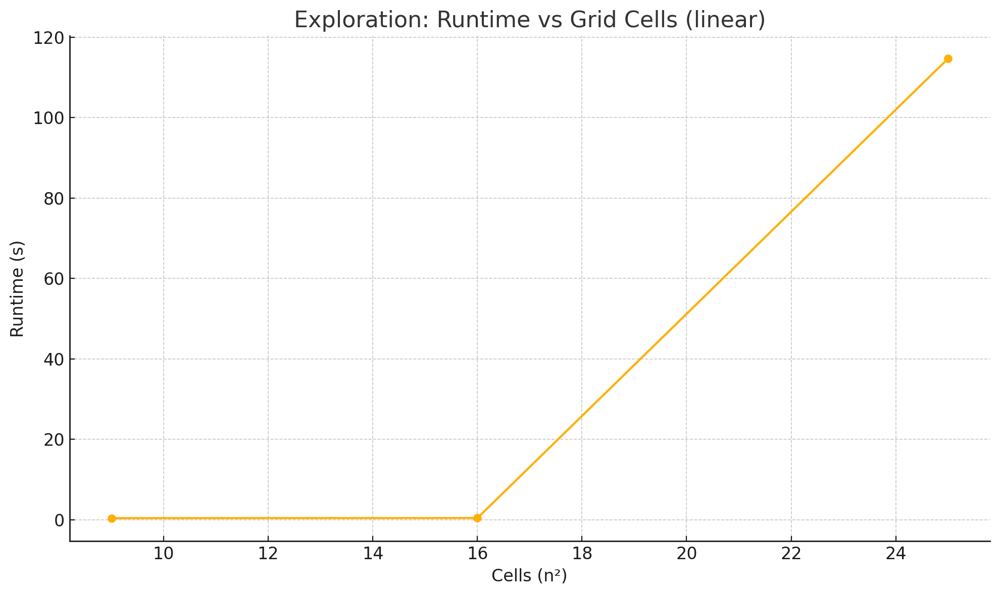

# Exploration-Domain Empirical Complexity Report  
*Planner – Fast Downward (`astar(lmcut())`), Ubuntu 22.04, image `fast-downward`*

```bash
# run exploration profiling
python docker/exploration_complexity_analysis.py explorationDomain.pddl problems/exploration \
       --docker-image fast-downward --mount "$(pwd)"
````

---

## 1 Benchmark Overview

Two robots (`B`, `G`) must **observe** every cell in an *n×n* grid and both end at the far corner.
We measured optimal cost planning (minimize total-cost) on 3×3, 4×4 and 5×5 grids.

---

## 2 Dataset

| Problem            | Grid Size | Nodes Expanded | Runtime (s) |
| ------------------ | --------: | -------------: | ----------: |
| `explore-3x3.pddl` |       3×3 |            241 |        0.37 |
| `explore-4x4.pddl` |       4×4 |          1 087 |        0.40 |
| `explore-5x5.pddl` |       5×5 |      1 790 262 |      114.66 |
| `explore-6x6.pddl` |       6x6 |      --------- | didnt finish|

---

## 3 Theoretical Expectations

* **State space**: each of the 2 robots can be in any of *n²* cells, and each cell can be explored or not → O((n²·2)·2^{n²}) configurations.
* **Worst-case search**: exponential in number of cells, at least O(2^{n²}).

This domain is essentially a two-agent cover problem; optimal search is **exponential**.

---

## 4 Empirical Complexity

| Grid | Cells (n²) |     Nodes | Runtime (s) |
| ---: | ---------: | --------: | ----------: |
|  3×3 |          9 |       241 |        0.37 |
|  4×4 |         16 |     1 087 |        0.40 |
|  5×5 |         25 | 1 790 262 |      114.66 |

* **3→4**: +7 cells yielded \~4.5× more nodes, runtime flat (fixed overhead dominates small N).
* **4→5**: +9 cells yielded \~1 650× nodes and **285×** slower runtime.

---

## 5 Visual Sketch

With only three points, the plot already shows steep curvature:



---

## 6 Interpretation

1. **Exponential blow-up**: Adding a few cells causes massive growth in expanded states.
2. **Heuristic limitations**: `lmcut()` helps cost-optimality but can’t prune the exponential combinations of “which cells remain unexplored.”
3. **Practical limit**: 5×5 already takes \~2 minutes; 6×6 will be effectively intractable without heuristic enhancements or decomposition.

---

## 7 Next Steps

* **Relax optimality**: switch to satisficing search (`lazy_greedy(ff())`) to get quick but suboptimal coverage plans.
* **Divide & conquer**: partition the grid into regions and solve sequentially.

