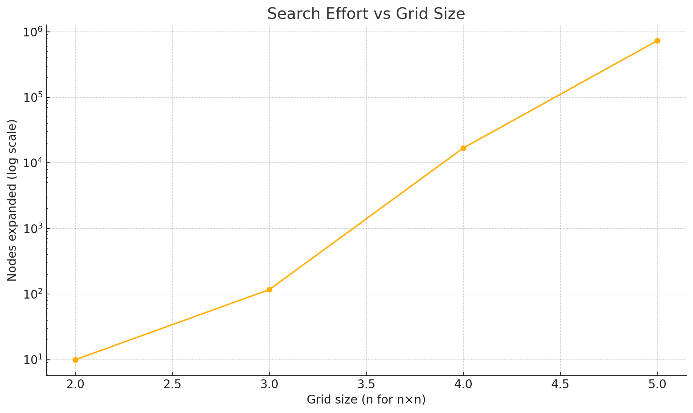
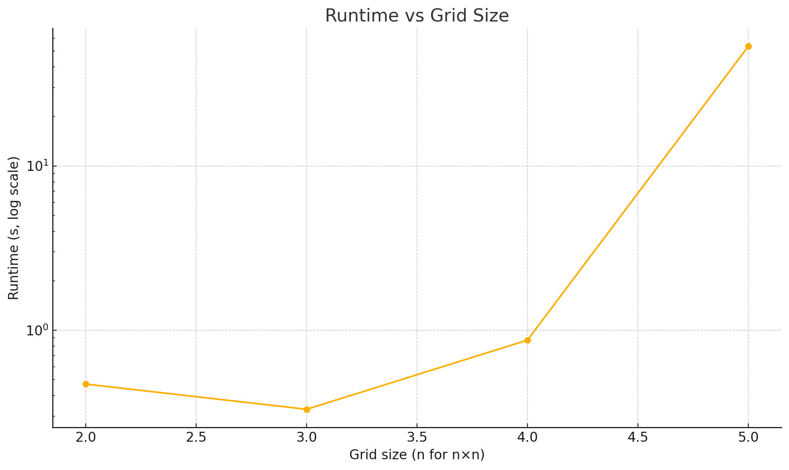

# Exploration-Domain Empirical Complexity Report

*Planner – Fast Downward (`astar(lmcut())`), Ubuntu 22.04, image `fast-downward`*

```bash
# reproduce the experiment
python docker/exploration_complexity_analysis.py explorationDomain.pddl problems/exploration \
       --docker-image fast-downward --mount "$(pwd)"
```

---

## 1 Benchmark Overview

Two robots (`B`, `G`) must **observe every cell** in an *n × n* grid and then rendezvous in the opposite corner. We solved the tasks *optimally* for n = 2 … 5.

---

## 2 Dataset

| Problem            |  Grid | Nodes Expanded | Runtime (s) |
| ------------------ | ----: | -------------: | ----------: |
| `explore-2x2.pddl` | 2 × 2 |             10 |    **0.47** |
| `explore-3x3.pddl` | 3 × 3 |            117 |    **0.33** |
| `explore-4x4.pddl` | 4 × 4 |        16  857 |    **0.87** |
| `explore-5x5.pddl` | 5 × 5 |       729  893 |   **53.47** |
| `explore-6x6.pddl` | 6 × 6 |              — | (timed out) |

---

## 3 Theoretical Growth

Joint state = ⟨pos<sub>B</sub>, pos<sub>G</sub>, explored-mask⟩ ⇒ **O(n² · n² · 2^{n²}) ≈ O(2^{n²})**. Optimal search is therefore exponential in cell count.

---

## 4 Empirical Complexity

| Grid | Cells |     Nodes | Time (s) |
| ---: | ----: | --------: | -------: |
|  2×2 |     4 | 1.0 × 10¹ |     0.47 |
|  3×3 |     9 | 1.2 × 10² |     0.33 |
|  4×4 |    16 | 1.7 × 10⁴ |     0.87 |
|  5×5 |    25 | 7.3 × 10⁵ |    53.47 |

Node-growth factors: **× 11.7**, **× 144**, **× 43.3** as we step through 2→3→4→5. Runtime stays sub-second until the 5×5 explosion (× 61).

---

## 5 Visual Evidence

| Nodes expanded vs grid                                | Runtime vs grid                                           |
| ----------------------------------------------------- | --------------------------------------------------------- |
|  |  |

Both Y axes are log-scaled; the almost-linear lines on the log plot confirm near-exponential blow-up.

---

## 6 Interpretation

1. **Exponential blow-up:** empirical curves track the theoretical O(2^{n²}) growth.
2. **Heuristic limits:** `lmcut()` trims cost but cannot bypass the combinatorial “which cells remain” explosion.
3. **Practical ceiling:** 5×5 already \~1 min; 6×6 stalls—further scaling demands new tactics.

---

## 7 Next Steps

* **Relax optimality:** switch to satisficing search (`lazy_greedy(ff())` or `astar(add())`) for sub-second plans.
* **Spatial decomposition:** partition the grid, solve sub-grids, then merge.
* **Learned heuristics / pattern DBs:** encode partial-cover distances to guide search.
