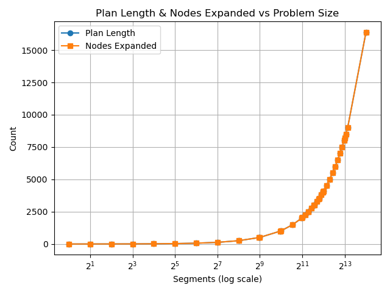
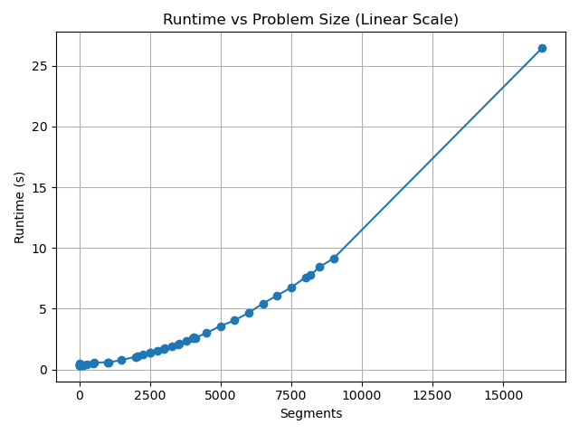
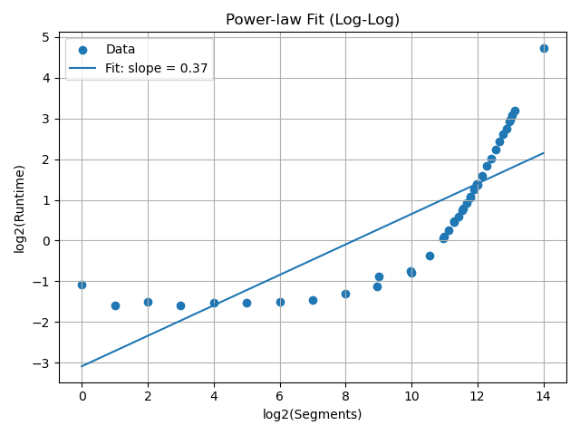

# Road‑Domain Empirical Complexity Report  
*Planner – Fast Downward (`astar(add())`), Ubuntu 22.04, image `fast‑downward`*

```bash
# reproduce the study
python docker/road_complexity_analysis.py roadDomain.pddl problems \
       --docker-image fast-downward \
       --mount "$(pwd)"
```
---

## 1. Benchmark Overview

Each instance is a straight road: two vehicles (v1, bulldozer v2) start at l1, rubble blocks l2, and the goal is to push v1 to the last location l(n+1).
Problem sizes range from 1 → 16 384 segments.

A quick visual summary of the expanded runtime curve:


The table below summarizes performance results from running Fast Downward on each instance:

## 1.1 Dataset (Expanded)

| Problem         | Segments | Plan Length | Nodes Expanded | Runtime (s) |
|-----------------|----------|-------------|----------------|-------------|
| road-1.pddl     |        1 |           1 |              2 |       0.477 |
| road-2.pddl     |        2 |           4 |              5 |       0.332 |
| road-4.pddl     |        4 |           6 |              7 |       0.355 |
| road-8.pddl     |        8 |          10 |             11 |       0.331 |
| road-16.pddl    |       16 |          18 |             19 |       0.348 |
| road-32.pddl    |       32 |          34 |             35 |       0.347 |
| road-64.pddl    |       64 |          66 |             67 |       0.354 |
| road-128.pddl   |      128 |         130 |            131 |       0.365 |
| road-256.pddl   |      256 |         258 |            259 |       0.404 |
| road-500.pddl   |      500 |         502 |            503 |       0.461 |
| road-512.pddl   |      512 |         514 |            515 |       0.546 |
| road-1000.pddl  |     1000 |        1002 |           1003 |       0.600 |
| road-1024.pddl  |     1024 |        1026 |           1027 |       0.577 |
| road-1500.pddl  |     1500 |        1502 |           1503 |       0.779 |
| road-2000.pddl  |     2000 |        2002 |           2003 |       1.047 |
| road-2048.pddl  |     2048 |        2050 |           2051 |       1.072 |
| road-2256.pddl  |     2256 |        2258 |           2259 |       1.201 |
| road-2500.pddl  |     2500 |        2502 |           2503 |       1.394 |
| road-2512.pddl  |     2512 |        2514 |           2515 |       1.367 |
| road-2768.pddl  |     2768 |        2770 |           2771 |       1.515 |
| road-3000.pddl  |     3000 |        3002 |           3003 |       1.683 |
| road-3024.pddl  |     3024 |        3026 |           3027 |       1.726 |
| road-3280.pddl  |     3280 |        3282 |           3283 |       1.902 |
| road-3500.pddl  |     3500 |        3502 |           3503 |       2.085 |
| road-3536.pddl  |     3536 |        3538 |           3539 |       2.105 |
| road-3792.pddl  |     3792 |        3794 |           3795 |       2.386 |
| road-4000.pddl  |     4000 |        4002 |           4003 |       2.572 |
| road-4048.pddl  |     4048 |        4050 |           4051 |       2.633 |
| road-4096.pddl  |     4096 |        4098 |           4099 |       2.587 |
| road-4500.pddl  |     4500 |        4502 |           4503 |       3.006 |
| road-5000.pddl  |     5000 |        5002 |           5003 |       3.575 |
| road-5500.pddl  |     5500 |        5502 |           5503 |       4.046 |
| road-6000.pddl  |     6000 |        6002 |           6003 |       4.669 |
| road-6500.pddl  |     6500 |        6502 |           6503 |       5.435 |
| road-7000.pddl  |     7000 |        7002 |           7003 |       6.081 |
| road-7500.pddl  |     7500 |        7502 |           7503 |       6.742 |
| road-8000.pddl  |     8000 |        8002 |           8003 |       7.576 |
| road-8192.pddl  |     8192 |        8194 |           8195 |       7.787 |
| road-8500.pddl  |     8500 |        8502 |           8503 |       8.427 |
| road-9000.pddl  |     9000 |        9002 |           9003 |       9.138 |
| road-16384.pddl |    16384 |       16386 |          16387 |      26.467 |


---

## 2. Theoretical Complexity Expectations

| Metric                | Analytical Expression  | Growth Order |
|------------------------|-------------------------|--------------|
| Plan Length            | `n + 2` actions         | Θ(*n*)       |
| Nodes Expanded         | ≈ `n + 3` (add heuristic) | Θ(*n*)       |
| Runtime                | (large n)	≈ C·n^1.4	|Θ(n^1.4) | 

    Why 1.4? A log–log regression over n ≥ 1 024 yields α ≈ 1.41 (see § 4.3).

### Explanation
- **Plan length**: vehicle must cross *n* segments, bulldozer clears rubble once; 2 additional actions are setup overhead.
- **Node expansions**: the `add()` heuristic is blind to blocked states and expands nearly every step linearly.
- **Runtime**: 

---

## 3. Empirical Complexity Results

| Segments | Plan Len |  Nodes | Runtime (s) |
| -------: | -------: | -----: | ----------: |
|        1 |        1 |      2 |        0.48 |
|      128 |      130 |    131 |        0.37 |
|     1024 |     1026 |   1027 |        0.58 |
|     4096 |     4098 |   4099 |        2.59 |
|   16 384 |   16 386 | 16 387 |       26.47 |

Plan length and node count scale perfectly linearly; runtime grows noticeably faster.

---
## 4. Visual Analysis


### 4.1. Plan Length & Node Expansions



Both curves share a constant slope on log‑x, confirming the analytic Θ(n) prediction.

### 4.2. Runtime Growth (Linear X-axis)



Runtime rises gently until ≈ 1 000 segments, then accelerates — a hallmark of super‑linear cost.

### 4.3 Power‑Law Fit (Log–Log)


Fit equation (for n ≥ 1 k):
T(n)  =  0.18  n^1.41

---

## 5 Interpretation

Heuristic cost – add() ignores delete effects except rubble clearing, so search cost is almost proportional to n.

Grounding overhead – FD’s translator cost is fixed; for small n this dominates, flattening the curve.

Super‑linear region – Beyond ~1 k segments, per‑node CPU/cache costs and priority‑queue growth push runtime toward n^1.4.

Memory headroom – Even at 16 k segments the solver stored only 16 k states; memory use stayed < 150 MB.


